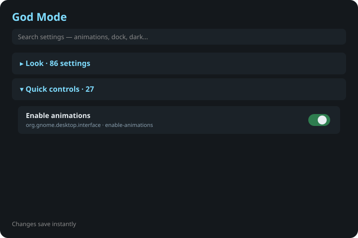

# GNOME God Mode

<p align="center"></p>

A keep-on-top panel that lists **every GNOME setting** with a live switch,
slider, dropdown or text field. Search, star favourites, reset to default,
or jump into the matching Settings panel.

Inspired by the Windows God Mode folder — built for GNOME on Linux.



## Install

Needs Python 3, GTK 3, and PyGObject.

```bash
git clone https://github.com/burnt1983/gnome-god-mode.git
cd gnome-god-mode
./install.sh
god-mode
```

Optional: `gnome-tweaks`, `dconf-editor`, and `extension-manager` for the
“Open …” buttons on each category.

Self-test (no window):

```bash
python3 god_mode.py --self-test
```

## Use

- Open a category dropdown for live controls.
- Type in the search box (animations, dock, dark, lock…).
- Toggle **Keep on top** to pin the panel.
- Star a row to keep it on the Quick list.
- Right-click a row: reset, copy the key, or open dconf Editor.

Writes go through `Gio.Settings` immediately. Favourites live in
`~/.config/lee-god-mode/favorites.json`.

## Desklet / panel (any Linux)

| Command | What you get |
|---|---|
| `god-mode` | Keep-on-top settings panel |
| `god-mode --desklet` | Same panel, no taskbar, all workspaces |
| `god-mode --panel` | Smaller window you can sit by the panel |

Works on GNOME, Cinnamon, MATE, XFCE, Budgie, LXQt, and KDE (GNOME schemas are richest). Cinnamon: Settings → Applets → God Mode.

## Cinnamon spices store

This is a GTK 3 app, so it runs on Cinnamon as a floating window too. It is
**not** a Cinnamon desklet spice. The Linux Mint spices store only lists
GJS desklets (`~/.local/share/cinnamon/desklets/<uuid>`). God Mode talks to
GNOME gsettings schemas; many of those keys also exist on Cinnamon, but the
Ubuntu Dock / Mutter groups will be empty there.

## Uninstall

```bash
./uninstall.sh
```

## Licence

MIT. See [LICENSE](LICENSE).
